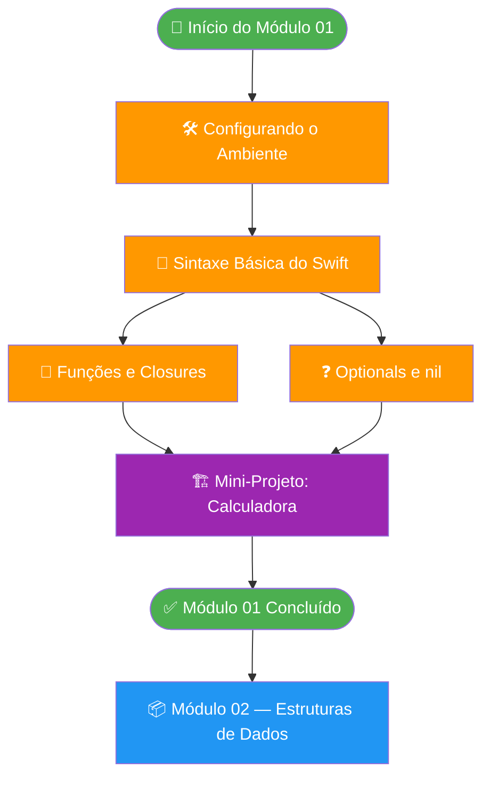

# Módulo 01 — Fundamentos do Swift

🟢 **Básico** · Módulo 01

Bem-vindo ao primeiro módulo do curso de iOS com Swift! Aqui você construirá a base sólida que sustentará todo o aprendizado futuro. Sem pressa — cada conceito será explicado com clareza, exemplos práticos e exercícios reais.

---

## O que é este módulo?

Este módulo cobre os **fundamentos essenciais da linguagem Swift**: desde a configuração do ambiente de desenvolvimento até a criação do seu primeiro mini-projeto funcional. Ao final, você terá confiança para ler e escrever código Swift básico, entender os pilares da linguagem e estar pronto para avançar para estruturas de dados e orientação a objetos.

!!! info "Por que Swift?"
    Swift é uma linguagem moderna, segura e expressiva criada pela Apple em 2014. É a linguagem principal para desenvolver apps para iPhone, iPad, Mac, Apple Watch e Apple TV. Ela combina a performance de C com a produtividade de linguagens de alto nível, com um sistema de tipos robusto que previne categorias inteiras de bugs em tempo de compilação.

---

## O que você vai aprender

- [x] Instalar e configurar o Xcode e o ambiente de desenvolvimento
- [x] Criar e usar Playgrounds para experimentação rápida
- [x] Declarar variáveis, constantes e trabalhar com tipos básicos
- [x] Escrever funções, usar parâmetros e retornar valores
- [x] Entender e utilizar Optionals para lidar com a ausência de valores
- [x] Construir um mini-projeto completo: uma calculadora em Playground
- [x] Aplicar boas práticas de estilo de código Swift desde o início

---

## Pré-requisitos

!!! warning "Antes de começar"
    Certifique-se de que você tem acesso a:

    - **Mac com macOS Ventura (13.0) ou superior** — Xcode não roda em Windows ou Linux
    - **Conta Apple ID gratuita** — necessária para baixar o Xcode da App Store
    - **Pelo menos 15 GB de espaço em disco** — o Xcode ocupa bastante espaço
    - **Conexão com internet** — para download inicial e documentação online

Conhecimento prévio desejável (mas não obrigatório):

- Lógica de programação básica (o que é uma variável, um loop, uma condição)
- Qualquer experiência com outra linguagem de programação é um bônus

---

## Tempo estimado

| Seção | Tempo estimado |
|---|---|
| Configurando o Ambiente | ~1h 30min |
| Sintaxe Básica do Swift | ~2h |
| Funções e Closures | ~2h |
| Optionals e Tratamento de nil | ~1h 30min |
| Mini-Projeto: Calculadora | ~1h |
| **Total do módulo** | **~8 horas** |

---

## Estrutura do módulo

=== "Visão Geral"

    ```
    Módulo 01 — Fundamentos
    ├── 🛠️  Configurando o Ambiente
    ├── 📝  Sintaxe Básica
    ├── 🔧  Funções e Closures
    ├── ❓  Optionals
    └── 🏗️  Mini-Projeto
    ```

=== "Dependências entre tópicos"

    Cada tópico depende do anterior. Siga a ordem recomendada para melhor aproveitamento.

    1. **Ambiente** → Base para tudo: sem Xcode não há prática
    2. **Sintaxe** → Vocabulário da linguagem
    3. **Funções** → Organização e reuso de código
    4. **Optionals** → Segurança contra nil (conceito único do Swift)
    5. **Mini-Projeto** → Consolida tudo na prática

---

## Fluxo dos tópicos



---

## Navegação do módulo

<div class="grid cards" markdown>

-   :material-wrench:{ .lg .middle } **Configurando o Ambiente**

    ---

    Instale o Xcode, crie seu primeiro Playground e conheça o Swift REPL.

    [:octicons-arrow-right-24: Começar](ambiente.md)

-   :material-code-tags:{ .lg .middle } **Sintaxe Básica do Swift**

    ---

    Variáveis, tipos, controle de fluxo e loops — o vocabulário essencial.

    [:octicons-arrow-right-24: Aprender](sintaxe.md)

-   :material-function:{ .lg .middle } **Funções e Closures**

    ---

    Como organizar código em funções reutilizáveis e usar closures poderosas.

    [:octicons-arrow-right-24: Explorar](funcoes.md)

-   :material-help-circle:{ .lg .middle } **Optionals e nil**

    ---

    O sistema de segurança do Swift para lidar com a ausência de valores.

    [:octicons-arrow-right-24: Entender](optionals.md)

-   :material-calculator:{ .lg .middle } **Mini-Projeto: Calculadora**

    ---

    Coloque tudo em prática construindo uma calculadora funcional do zero.

    [:octicons-arrow-right-24: Construir](projeto.md)

</div>

---

## Por que aprender desta forma?

!!! tip "Abordagem deste curso"
    Este curso segue uma abordagem **aprender fazendo** (*learn by doing*). Em vez de ler conceitos abstratos, você escreverá código real desde a primeira aula. Cada conceito novo é apresentado com:

    1. **Explicação clara** do "o quê" e do "por quê"
    2. **Exemplos de código** progressivos
    3. **Armadilhas comuns** (para você não cair nelas)
    4. **Exercícios práticos** para fixar o conhecimento

---

## Checklist de início

Antes de começar, confirme:

- [ ] Você tem um Mac com macOS 13 (Ventura) ou mais recente
- [ ] Você tem um Apple ID configurado
- [ ] Você tem espaço em disco suficiente (15 GB+)
- [ ] Você está animado para aprender Swift! 🚀

---

*Pronto? Vamos começar pela configuração do ambiente!*

[:octicons-arrow-right-24: Ir para: Configurando o Ambiente](ambiente.md){ .md-button .md-button--primary }
