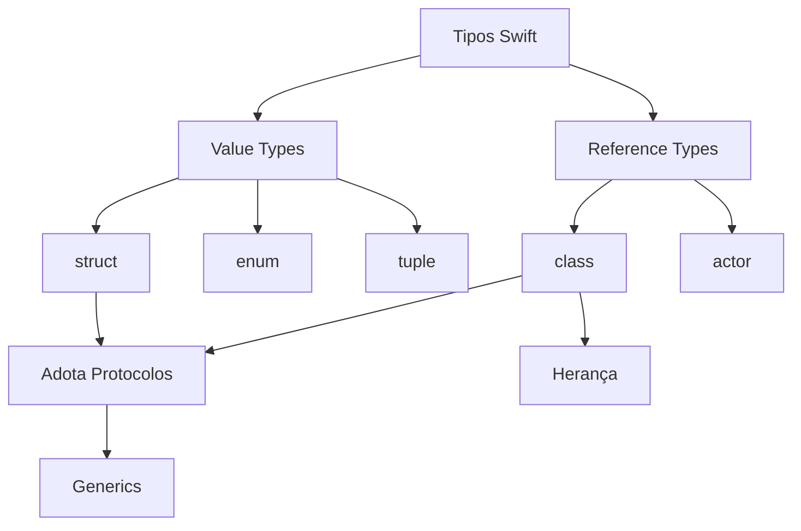

# Módulo 02 · OOP & Protocolos

🟡 **Intermediário** · Módulo 02

---

Bem-vindo ao Módulo 02! Após dominar os fundamentos de Swift, chegou a hora de mergulhar nos pilares da programação orientada a objetos e no estilo único que a Swift promove: a **Programação Orientada a Protocolos (POP)**.

## O que você vai aprender

=== "Conceitos"

    - Diferença fundamental entre `struct` (value type) e `class` (reference type)
    - Quando preferir um ou outro (guia oficial da Apple)
    - Propriedades armazenadas, computadas, lazy e observadores
    - Herança, inicializadores e desinicializadores
    - Protocolos: definição, adoção e extensões
    - Programação Orientada a Protocolos (POP)
    - Generics: funções e tipos genéricos, type constraints
    - Tipos opacos com `some`

=== "Habilidades Práticas"

    - Modelar domínios de problema com structs e classes
    - Criar hierarquias de tipo flexíveis com protocolos
    - Escrever código reutilizável e type-safe com Generics
    - Adotar protocolos da standard library (`Codable`, `Equatable`, `Identifiable`)
    - Construir uma biblioteca de mídia completa em Playground

=== "Mini-Projeto"

    Ao final do módulo você vai construir uma **Biblioteca de Mídia** em Swift Playground que:

    - [ ] Modela livros, filmes e músicas com structs
    - [ ] Compartilha comportamento comum via protocolos
    - [ ] Suporta buscas e filtros com generics
    - [ ] Serializa dados com `Codable`
    - [ ] Ordena itens com `Comparable`

---

## Pré-requisitos

!!! warning "Módulo 01 obrigatório"
    Este módulo assume que você completou o **Módulo 01 — Fundamentos** e está confortável com:

    - Variáveis, constantes, tipos básicos (`Int`, `String`, `Bool`, `Double`)
    - Estruturas de controle (`if`, `guard`, `for`, `while`, `switch`)
    - Funções, parâmetros e valores de retorno
    - Closures e funções de ordem superior
    - Optionals e unwrapping

    Se precisar revisar, volte ao [Módulo 01 →](../01-fundamentos/index.md).

---

## Tempo estimado

| Atividade | Tempo |
|-----------|-------|
| Structs e Classes | ~2h 30min |
| Protocolos | ~2h 30min |
| Generics | ~2h |
| Mini-Projeto | ~3h |
| **Total** | **~10 horas** |

---

## Estrutura do módulo

```
02-oop-protocolos/
├── index.md            ← Você está aqui
├── structs-classes.md  ← Value types vs reference types
├── protocolos.md       ← Contratos e Programação Orientada a Protocolos
├── generics.md         ← Código genérico e reutilizável
└── projeto.md          ← Mini-projeto: Biblioteca de Mídia
```

---

## Por que OOP & Protocolos importam?

!!! info "A filosofia Swift"
    Diferente de outras linguagens orientadas a objetos, Swift abraça um paradigma híbrido. A Apple recomenda **preferir structs a classes** na maioria dos casos e usar protocolos para compartilhar comportamento — em vez de herança.

    Isso resulta em código mais seguro, mais testável e mais fácil de raciocinar.

```swift
// Ao invés de uma hierarquia profunda de classes...
class Animal { ... }
class Mamifero: Animal { ... }
class Cachorro: Mamifero { ... }

// Swift prefere protocolos leves e composição:
protocol Descritivel {
    var descricao: String { get }
}

protocol Reprodutivel {
    func reproduzir() -> Self
}

struct Cachorro: Descritivel, Reprodutivel {
    var nome: String
    var descricao: String { "🐶 \(nome)" }
    func reproduzir() -> Cachorro { Cachorro(nome: "Filhote de \(nome)") }
}
```

---

## Conceito-chave: Value vs Reference

Antes de continuar, entenda a distinção mais importante do módulo:

=== "Value Types (Structs)"

    ```swift
    struct Ponto {
        var x: Double
        var y: Double
    }

    var a = Ponto(x: 1, y: 2)
    var b = a       // cópia independente
    b.x = 99

    print(a.x)  // 1.0 — 'a' não foi afetado
    print(b.x)  // 99.0
    ```

    **Comportamento:** cada variável tem sua própria cópia dos dados.

=== "Reference Types (Classes)"

    ```swift
    class Contador {
        var valor: Int = 0
    }

    let c1 = Contador()
    let c2 = c1     // mesma referência!
    c2.valor = 99

    print(c1.valor) // 99 — c1 foi afetado!
    print(c2.valor) // 99
    ```

    **Comportamento:** múltiplas variáveis podem apontar para o mesmo objeto na memória.

---

## Mapa de conceitos



---

## Checklist de progresso

Marque cada item conforme avançar:

- [ ] Li e entendi structs e classes
- [ ] Sei distinguir value type de reference type
- [ ] Entendo propriedades computadas e observadores
- [ ] Sei criar e adotar protocolos
- [ ] Entendo protocol extensions
- [ ] Sei usar Generics básicos
- [ ] Completei o mini-projeto

---

Pronto para começar? Vamos com [Structs e Classes →](structs-classes.md)
