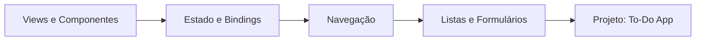

# Módulo 03 — SwiftUI

🟡 **Intermediário** · Estimativa: 12 horas

SwiftUI é o framework moderno da Apple para construir interfaces de usuário de forma declarativa. Lançado em 2019 e continuamente melhorado, é a **abordagem recomendada** para novos projetos iOS.

---

## O que você vai aprender



---

## Por que SwiftUI?

=== "SwiftUI"
    ```swift
    struct ContentView: View {
        @State private var nome = ""

        var body: some View {
            VStack {
                TextField("Nome", text: $nome)
                Text("Olá, \(nome)!")
            }
            .padding()
        }
    }
    ```
    - ✅ Código declarativo e conciso
    - ✅ Preview em tempo real
    - ✅ Multiplataforma (iOS, macOS, watchOS, tvOS)
    - ✅ Integração nativa com Swift Concurrency

=== "UIKit equivalente"
    ```swift
    class ViewController: UIViewController {
        let textField = UITextField()
        let label = UILabel()

        override func viewDidLoad() {
            super.viewDidLoad()
            // setup constraints, delegates, targets...
            textField.addTarget(self, action: #selector(textChanged), for: .editingChanged)
        }

        @objc func textChanged() {
            label.text = "Olá, \(textField.text ?? "")!"
        }
    }
    ```
    - Mais verboso e imperativo
    - Requer mais configuração manual
    - Ainda relevante para apps legados e casos específicos

---

## Pré-requisitos

Antes de começar este módulo, certifique-se de que:

- [x] Concluiu o [Módulo 01 — Fundamentos](../01-fundamentos/index.md)
- [x] Concluiu o [Módulo 02 — OOP & Protocolos](../02-oop-protocolos/index.md)
- [x] Tem o Xcode 15+ instalado
- [x] Conhece structs, protocolos e closures

---

## Estrutura do módulo

| Aula | Tópico | Tempo |
|---|---|---|
| 3.1 | [Componentes SwiftUI](componentes.md) | 2h |
| 3.2 | [Estado e Bindings](estado-bindings.md) | 3h |
| 3.3 | [Navegação](navegacao.md) | 2h |
| 3.4 | [Listas e Formulários](listas-formularios.md) | 2h |
| 3.5 | [Projeto: To-Do App](projeto.md) | 3h |

---

## Versões e compatibilidade

!!! info "Requisito mínimo"
    Este módulo usa recursos do **iOS 16+** (NavigationStack, etc.) e **iOS 17+** para o macro `@Observable`. As seções compatíveis com iOS 15 são indicadas.

| Recurso | iOS mínimo |
|---|---|
| SwiftUI básico | iOS 13 |
| `@StateObject` | iOS 14 |
| `NavigationStack` | iOS 16 |
| `@Observable` macro | iOS 17 |
| `SwiftData` | iOS 17 |
