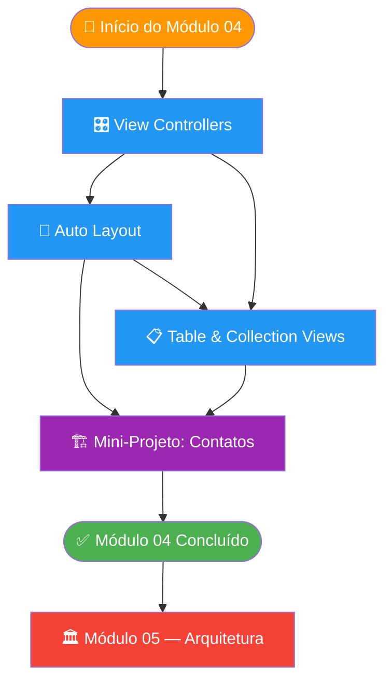
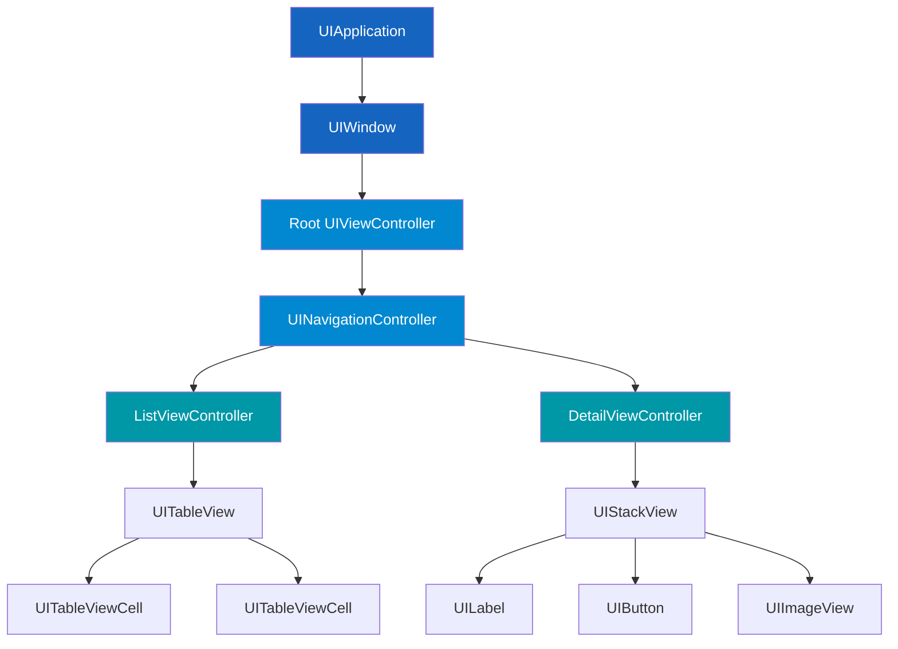

# Módulo 04 — UIKit

🟡 **Intermediário** · Módulo 04

Bem-vindo ao módulo de UIKit! Aqui você aprenderá o framework que dominou o desenvolvimento iOS por mais de uma década — e que ainda é absolutamente essencial para qualquer desenvolvedor iOS profissional.

---

## Por que aprender UIKit em 2024?

!!! info "UIKit ainda é rei no mercado de trabalho"
    Apesar do SwiftUI ter chegado em 2019 e estar evoluindo rapidamente, a realidade do mercado é clara: **a grande maioria dos apps iOS em produção foi construída com UIKit**, e continuará sendo mantida com UIKit por muitos anos.

    Veja por que você precisa dominar UIKit:

    - **Legado massivo**: apps de grandes empresas (bancos, fintechs, e-commerces) têm bases de código UIKit com anos de desenvolvimento
    - **Controle granular**: UIKit oferece controle pixel-a-pixel que SwiftUI ainda não consegue igualar
    - **Performance**: em listas longas e animações complexas, UIKit ainda leva vantagem
    - **Requisitos de iOS mínimo**: apps que precisam suportar iOS 13 ou anterior não podem usar SwiftUI completo
    - **Interoperabilidade**: saber UIKit te permite integrar componentes legados em apps SwiftUI e vice-versa

!!! tip "SwiftUI vs UIKit — não é uma guerra"
    Os dois frameworks convivem e se complementam. Um desenvolvedor completo sabe os dois.
    `UIHostingController` permite usar views SwiftUI dentro de UIKit.
    `UIViewRepresentable` permite usar views UIKit dentro de SwiftUI.

---

## O que você vai aprender

- [x] Entender o ciclo de vida de um `UIViewController`
- [x] Criar interfaces programaticamente (sem Storyboard)
- [x] Dominar Auto Layout com `NSLayoutAnchor`
- [x] Construir listas eficientes com `UITableView` e `UICollectionView`
- [x] Usar `Diffable Data Source` para updates animados
- [x] Navegar entre telas com `UINavigationController`
- [x] Passar dados entre View Controllers
- [x] Construir um app de contatos completo do zero

---

## Pré-requisitos

!!! warning "Antes de começar este módulo"
    Você precisa ter concluído:

    - **Módulo 01** — Fundamentos do Swift (variáveis, funções, closures, optionals)
    - **Módulo 02** — OOP & Protocolos (structs, classes, protocolos, generics)
    - **Módulo 03** — SwiftUI (familiaridade com o paradigma declarativo ajuda a contrastar com UIKit)

    Conhecimentos específicos necessários:
    - Closures (muito usadas em UIKit como callbacks)
    - Protocolos (UITableViewDataSource, UITableViewDelegate são protocolos)
    - Classes e herança (UIViewController é uma classe)

---

## Tempo estimado

| Seção | Tempo estimado |
|---|---|
| View Controllers no UIKit | ~2h 30min |
| Auto Layout | ~2h 30min |
| Table Views e Collection Views | ~2h 30min |
| Mini-Projeto: App de Contatos | ~2h 30min |
| **Total do módulo** | **~10 horas** |

---

## Estrutura do módulo

=== "Visão Geral"

    ```
    Módulo 04 — UIKit
    ├── 🎛️  View Controllers
    │   ├── Ciclo de vida
    │   ├── Criação programática
    │   ├── Navegação e modais
    │   └── Passagem de dados
    ├── 📐  Auto Layout
    │   ├── NSLayoutConstraint
    │   ├── NSLayoutAnchor
    │   ├── UIStackView
    │   └── Safe Area
    ├── 📋  Table & Collection Views
    │   ├── UITableView
    │   ├── Custom cells
    │   ├── Diffable Data Source
    │   └── UICollectionView
    └── 🏗️  Mini-Projeto: App de Contatos
    ```

=== "Dependências entre tópicos"

    Os tópicos se constroem progressivamente:

    1. **View Controllers** → Base de tudo: toda tela UIKit é um VC
    2. **Auto Layout** → Como posicionar views dentro dos VCs
    3. **Table Views** → Como exibir listas de dados (usa VCs + Auto Layout)
    4. **Mini-Projeto** → Une tudo em um app real

---

## Fluxo dos tópicos



---

## UIKit em uma imagem



---

## Comparação: UIKit vs SwiftUI

| Aspecto | UIKit | SwiftUI |
|---|---|---|
| Paradigma | Imperativo | Declarativo |
| Layout | Auto Layout (código ou Interface Builder) | Layout automático com modificadores |
| Ciclo de vida | Explícito (`viewDidLoad`, etc.) | Gerenciado pelo framework |
| Performance em listas | Excelente (cell reuse manual) | Boa (gerenciada automaticamente) |
| Curva de aprendizado | Mais íngreme | Mais suave |
| Animações complexas | Total controle | Limitado em casos extremos |
| iOS mínimo | iOS 2+ | iOS 13+ |
| Uso no mercado (2024) | Dominante | Crescente |

---

## Navegação do módulo

<div class="grid cards" markdown>

-   :material-view-dashboard:{ .lg .middle } **View Controllers**

    ---

    Ciclo de vida, criação programática, navegação e passagem de dados entre telas.

    [:octicons-arrow-right-24: Começar](viewcontrollers.md)

-   :material-ruler-square:{ .lg .middle } **Auto Layout**

    ---

    Posicione views com precisão usando NSLayoutAnchor, StackViews e Safe Area.

    [:octicons-arrow-right-24: Aprender](autolayout.md)

-   :material-table-large:{ .lg .middle } **Table & Collection Views**

    ---

    Listas performáticas, células customizadas e Diffable Data Source.

    [:octicons-arrow-right-24: Explorar](tableviews.md)

-   :material-contacts:{ .lg .middle } **Mini-Projeto: App de Contatos**

    ---

    Construa um app de contatos completo com lista, detalhes e formulário de edição.

    [:octicons-arrow-right-24: Construir](projeto.md)

</div>

---

## Checklist de início

Antes de mergulhar no UIKit, confirme:

- [ ] Você completou os Módulos 01, 02 e 03
- [ ] Você entende closures e como passá-las como parâmetros
- [ ] Você sabe o que é um protocolo e como implementá-lo
- [ ] Você tem o Xcode 15+ instalado
- [ ] Você criou ao menos um projeto iOS no Xcode antes

---

*Pronto para o UIKit? Vamos começar pelo coração de qualquer app: o View Controller!*

[:octicons-arrow-right-24: Ir para: View Controllers](viewcontrollers.md){ .md-button .md-button--primary }
