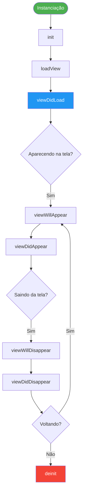

# View Controllers no UIKit

🟡 **Intermediário** · Módulo 04

O `UIViewController` é o coração de qualquer aplicativo UIKit. Cada tela do seu app é (ou contém) um View Controller. Entender seu ciclo de vida e como trabalhar com ele programaticamente é a habilidade mais fundamental do desenvolvimento UIKit.

---

## O que é um UIViewController?

Um `UIViewController` é o **mediador** entre os dados do seu app e a interface visual. Ele:

- Gerencia uma hierarquia de `UIView`s
- Responde a eventos do sistema (memória baixa, rotação de tela)
- Coordena a transição entre telas
- Recebe e processa input do usuário

!!! info "MVC no UIKit"
    No UIKit, a Apple adotou o padrão MVC (Model-View-Controller). O ViewController gerencia tanto a View quanto parte da lógica — o que pode levar ao famoso "Massive View Controller" se não houver disciplina. Falaremos mais sobre isso no Módulo 05.

---

## Ciclo de vida do UIViewController

O ciclo de vida define **quando** cada método é chamado durante a existência de um View Controller. Entender isso é crítico para inicializar dados, fazer requisições de rede e limpar recursos corretamente.



### Cada método explicado

=== "viewDidLoad"

    ```swift
    override func viewDidLoad() {
        super.viewDidLoad() // (1)
        
        // ✅ IDEAL PARA:
        setupUI()           // Criar e configurar views
        setupConstraints()  // Aplicar Auto Layout
        setupDelegates()    // Configurar delegates
        // NÃO faça requests de rede aqui se precisar de dados frescos
    }
    ```

    1. Sempre chame `super.viewDidLoad()` primeiro!

    Chamado **uma única vez** após a view ser carregada na memória. É o lugar ideal para configuração inicial da UI.

=== "viewWillAppear"

    ```swift
    override func viewWillAppear(_ animated: Bool) {
        super.viewWillAppear(animated)
        
        // ✅ IDEAL PARA:
        fetchData()         // Buscar dados que podem ter mudado
        navigationController?.setNavigationBarHidden(false, animated: animated)
        
        // Chamado CADA VEZ que a view vai aparecer
        // (inclusive ao voltar de outra tela)
    }
    ```

    Chamado **antes** da view aparecer na tela. Chamado múltiplas vezes — sempre que o VC vai se tornar visível.

=== "viewDidAppear"

    ```swift
    override func viewDidAppear(_ animated: Bool) {
        super.viewDidAppear(animated)
        
        // ✅ IDEAL PARA:
        startAnimations()   // Animações que devem começar com a view visível
        startCamera()       // Recursos que precisam de view visível
        showOnboarding()    // Alertas/modais que devem aparecer após a view
    }
    ```

    Chamado **após** a view aparecer. A animação de transição já terminou.

=== "viewWillDisappear"

    ```swift
    override func viewWillDisappear(_ animated: Bool) {
        super.viewWillDisappear(animated)
        
        // ✅ IDEAL PARA:
        saveState()         // Salvar estado antes de sair
        pauseVideo()        // Pausar media
        hideKeyboard()      // Dispensar teclado
    }
    ```

    Chamado antes da view desaparecer. Bom momento para salvar estado.

=== "viewDidDisappear"

    ```swift
    override func viewDidDisappear(_ animated: Bool) {
        super.viewDidDisappear(animated)
        
        // ✅ IDEAL PARA:
        stopCamera()        // Parar recursos caros
        cancelRequests()    // Cancelar downloads desnecessários
    }
    ```

    Chamado após a view desaparecer completamente.

=== "deinit"

    ```swift
    deinit {
        // ✅ IDEAL PARA:
        NotificationCenter.default.removeObserver(self)
        cancellables.removeAll()
        print("ViewController foi destruído") // Debug
        
        // NÃO chame super.deinit() em Swift
    }
    ```

    Chamado quando o VC é desalocado da memória. Limpe referências circulares aqui.

---

## Criação programática vs Storyboard

!!! tip "Recomendação deste curso: Programático"
    Embora Storyboards sejam visualmente intuitivos, a indústria tem migrado fortemente para criação programática por razões de:
    - **Merge conflicts**: Storyboards são XML e conflitos são pesadelos
    - **Code review**: impossível revisar XML de layout visualmente
    - **Reutilização**: código é mais reutilizável que Storyboards
    - **Performance**: Storyboards são carregados em runtime via serialização XML

=== "Programático (Recomendado)"

    ```swift
    import UIKit

    class PerfilViewController: UIViewController {
        
        // MARK: - UI Components
        
        private let avatarImageView: UIImageView = { // (1)
            let imageView = UIImageView()
            imageView.contentMode = .scaleAspectFill
            imageView.clipsToBounds = true
            imageView.layer.cornerRadius = 50
            imageView.backgroundColor = .systemGray5
            imageView.translatesAutoresizingMaskIntoConstraints = false // (2)
            return imageView
        }()
        
        private let nomeLabel: UILabel = {
            let label = UILabel()
            label.font = .systemFont(ofSize: 24, weight: .bold)
            label.textAlignment = .center
            label.translatesAutoresizingMaskIntoConstraints = false
            return label
        }()
        
        private let editarButton: UIButton = {
            var config = UIButton.Configuration.filled() // (3)
            config.title = "Editar Perfil"
            config.cornerStyle = .medium
            let button = UIButton(configuration: config)
            button.translatesAutoresizingMaskIntoConstraints = false
            return button
        }()
        
        // MARK: - Properties
        
        var usuario: Usuario?
        
        // MARK: - Lifecycle
        
        override func viewDidLoad() {
            super.viewDidLoad()
            setupUI()
            setupConstraints()
            setupActions()
            configurar(com: usuario)
        }
        
        // MARK: - Setup
        
        private func setupUI() {
            view.backgroundColor = .systemBackground
            title = "Perfil"
            
            view.addSubview(avatarImageView)
            view.addSubview(nomeLabel)
            view.addSubview(editarButton)
        }
        
        private func setupConstraints() {
            NSLayoutConstraint.activate([
                avatarImageView.topAnchor.constraint(
                    equalTo: view.safeAreaLayoutGuide.topAnchor, 
                    constant: 32
                ),
                avatarImageView.centerXAnchor.constraint(equalTo: view.centerXAnchor),
                avatarImageView.widthAnchor.constraint(equalToConstant: 100),
                avatarImageView.heightAnchor.constraint(equalToConstant: 100),
                
                nomeLabel.topAnchor.constraint(
                    equalTo: avatarImageView.bottomAnchor, 
                    constant: 16
                ),
                nomeLabel.leadingAnchor.constraint(
                    equalTo: view.leadingAnchor, 
                    constant: 24
                ),
                nomeLabel.trailingAnchor.constraint(
                    equalTo: view.trailingAnchor, 
                    constant: -24
                ),
                
                editarButton.topAnchor.constraint(
                    equalTo: nomeLabel.bottomAnchor, 
                    constant: 32
                ),
                editarButton.centerXAnchor.constraint(equalTo: view.centerXAnchor),
                editarButton.widthAnchor.constraint(equalToConstant: 200)
            ])
        }
        
        private func setupActions() {
            editarButton.addTarget(
                self, 
                action: #selector(editarTapped), 
                for: .touchUpInside
            )
        }
        
        // MARK: - Configuration
        
        private func configurar(com usuario: Usuario?) {
            guard let usuario else { return }
            nomeLabel.text = usuario.nome
        }
        
        // MARK: - Actions
        
        @objc private func editarTapped() {
            let editVC = EditarPerfilViewController()
            editVC.usuario = usuario
            navigationController?.pushViewController(editVC, animated: true)
        }
    }
    ```

    1. Usar uma closure para inicializar propriedades é um padrão muito comum em UIKit programático.
    2. **NUNCA esqueça isso!** Sem essa linha, o Auto Layout não funciona para views criadas programaticamente.
    3. `UIButton.Configuration` é a API moderna (iOS 15+) para configurar botões.

=== "Storyboard (Referência)"

    ```swift
    // Com Storyboard, o ViewController é carregado via segue ou:
    let storyboard = UIStoryboard(name: "Main", bundle: nil)
    let vc = storyboard.instantiateViewController(
        withIdentifier: "PerfilViewController"
    ) as! PerfilViewController
    
    // Outlets são conectados via IB:
    @IBOutlet weak var avatarImageView: UIImageView!
    @IBOutlet weak var nomeLabel: UILabel!
    @IBOutlet weak var editarButton: UIButton!
    
    // Actions também:
    @IBAction func editarTapped(_ sender: UIButton) {
        // código
    }
    ```

    Com Storyboard, você conecta outlets e actions visualmente no Interface Builder.

---

## Hierarquia de UIView

Toda UI no UIKit é uma árvore de views. Entender essa hierarquia é fundamental.

```swift
// view é a view raiz de todo UIViewController
view.addSubview(containerView)           // Adiciona subview
containerView.addSubview(imageView)      // Hierarquia aninhada
containerView.addSubview(titleLabel)

// Inspecionar a hierarquia em debug:
// Xcode > Debug > View Hierarchy (ou Cmd+Shift+D durante debug)

// Remover uma view:
imageView.removeFromSuperview()

// Reordenar views (z-order):
view.bringSubviewToFront(overlayView)
view.sendSubviewToBack(backgroundView)
view.insertSubview(newView, aboveSubview: existingView)
view.insertSubview(newView, at: 0) // Mais atrás possível
```

!!! warning "Hierarquia e Auto Layout"
    Uma view só pode ter constraints com views que compartilham o mesmo `superview` ou estão em relação de ancestral/descendente. Tentar criar constraints entre views irmãs em superviews diferentes causará crash.

---

## Navegação com UINavigationController

O `UINavigationController` é um **container** que gerencia uma pilha (stack) de View Controllers, fornecendo a barra de navegação e transições padrão.

```swift
// MARK: - Configurando o NavigationController (AppDelegate/SceneDelegate)

func scene(_ scene: UIScene, 
           willConnectTo session: UISceneSession,
           options connectionOptions: UIScene.ConnectionOptions) {
    guard let windowScene = (scene as? UIWindowScene) else { return }
    
    let window = UIWindow(windowScene: windowScene)
    
    let homeVC = HomeViewController()
    let navController = UINavigationController(rootViewController: homeVC) // (1)
    
    window.rootViewController = navController
    window.makeKeyAndVisible()
    self.window = window
}
```

1. O `rootViewController` é sempre o primeiro VC na pilha de navegação.

```swift
// MARK: - Navegação entre telas

class HomeViewController: UIViewController {
    
    // Push: empilha um novo VC (cria botão de voltar automático)
    func irParaDetalhes(item: Item) {
        let detalheVC = DetalheViewController()
        detalheVC.item = item
        navigationController?.pushViewController(detalheVC, animated: true)
    }
    
    // Pop: volta para o VC anterior
    func voltarHome() {
        navigationController?.popViewController(animated: true)
    }
    
    // Pop para o root: volta direto para o início
    func voltarParaInicio() {
        navigationController?.popToRootViewController(animated: true)
    }
    
    // Customizar a barra de navegação
    override func viewDidLoad() {
        super.viewDidLoad()
        
        title = "Home" // (1)
        
        // Botão direito na navigation bar
        let addButton = UIBarButtonItem(
            systemImage: "plus",
            primaryAction: UIAction { [weak self] _ in
                self?.adicionarItem()
            }
        )
        navigationItem.rightBarButtonItem = addButton
        
        // Botão esquerdo customizado
        let filtroButton = UIBarButtonItem(
            title: "Filtrar",
            style: .plain,
            target: self,
            action: #selector(filtrarTapped)
        )
        navigationItem.leftBarButtonItem = filtroButton
        
        // Appearance da navigation bar
        let appearance = UINavigationBarAppearance()
        appearance.configureWithOpaqueBackground()
        appearance.backgroundColor = .systemBlue
        appearance.titleTextAttributes = [.foregroundColor: UIColor.white]
        navigationController?.navigationBar.standardAppearance = appearance
        navigationController?.navigationBar.scrollEdgeAppearance = appearance
    }
}
```

1. `title` aparece na navigation bar E também é o texto do botão "Voltar" na tela seguinte.

---

## Apresentando modalmente

Modais são VCs que aparecem sobre o conteúdo atual, sem fazer parte da pilha de navegação.

```swift
// MARK: - Apresentação modal

class ListaViewController: UIViewController {
    
    func apresentarFormulario() {
        let formVC = FormularioViewController()
        formVC.delegate = self
        
        // Estilo de apresentação
        formVC.modalPresentationStyle = .pageSheet  // (1)
        formVC.modalTransitionStyle = .coverVertical
        
        // Em iOS 15+: configurar detents (altura do sheet)
        if let sheet = formVC.sheetPresentationController {
            sheet.detents = [.medium(), .large()] // (2)
            sheet.prefersGrabberVisible = true
            sheet.prefersScrollingExpandsWhenScrolledToEdge = false
        }
        
        present(formVC, animated: true)
    }
    
    // Dismissar modal de dentro do próprio VC modal
    func dismissarModal() {
        dismiss(animated: true) {
            // Executado após a animação
            print("Modal dispensado")
        }
    }
}
```

1. `.pageSheet` é o padrão moderno no iOS. Outros: `.fullScreen`, `.formSheet`, `.overFullScreen`.
2. `detents` definem os "encaixes" do sheet — `.medium()` = metade da tela, `.large()` = tela cheia.

---

## Passagem de dados entre View Controllers

Esta é uma das partes mais importantes — e mais discutidas — do UIKit.

=== "Propriedades (Push/Present)"

    ```swift
    // Mais simples: definir propriedades antes de navegar
    
    struct Produto {
        let id: Int
        let nome: String
        let preco: Double
    }
    
    class ListaProdutosVC: UIViewController {
        
        func selecionarProduto(_ produto: Produto) {
            let detalheVC = DetalheProdutoVC()
            detalheVC.produto = produto // (1)
            navigationController?.pushViewController(detalheVC, animated: true)
        }
    }
    
    class DetalheProdutoVC: UIViewController {
        var produto: Produto? // Recebe o dado
        
        override func viewDidLoad() {
            super.viewDidLoad()
            guard let produto else { return }
            title = produto.nome
            // configura UI com produto
        }
    }
    ```

    1. Defina `var produto: Produto?` no VC de destino **antes** de fazer o push.

=== "Delegate Pattern"

    ```swift
    // Comunicação de volta (filho -> pai) via protocolo
    
    // 1. Defina o protocolo
    protocol FormularioDelegate: AnyObject { // (1)
        func formularioDidSalvar(contato: Contato)
        func formularioDidCancelar()
    }
    
    // 2. VC filho usa o delegate
    class FormularioVC: UIViewController {
        weak var delegate: FormularioDelegate? // (2)
        
        @objc func salvarTapped() {
            let contato = Contato(nome: nomeField.text ?? "")
            delegate?.formularioDidSalvar(contato: contato)
            dismiss(animated: true)
        }
        
        @objc func cancelarTapped() {
            delegate?.formularioDidCancelar()
            dismiss(animated: true)
        }
    }
    
    // 3. VC pai implementa o protocolo e se define como delegate
    class ListaContatosVC: UIViewController, FormularioDelegate {
        
        func adicionarContato() {
            let formVC = FormularioVC()
            formVC.delegate = self // (3)
            present(formVC, animated: true)
        }
        
        // Implementação do protocolo
        func formularioDidSalvar(contato: Contato) {
            contatos.append(contato)
            tableView.reloadData()
        }
        
        func formularioDidCancelar() {
            // nada necessário
        }
    }
    ```

    1. `AnyObject` é necessário para usar `weak var` — apenas classes podem ser fracamente referenciadas.
    2. **Sempre `weak`!** Evita retain cycle (VC filho retendo VC pai).
    3. O pai se define como delegate do filho antes de apresentá-lo.

=== "Callbacks (Closures)"

    ```swift
    // Alternativa moderna ao delegate: closure de callback
    
    class FormularioVC: UIViewController {
        
        // Callback opcionais
        var onSalvar: ((Contato) -> Void)? // (1)
        var onCancelar: (() -> Void)?
        
        @objc func salvarTapped() {
            let contato = Contato(nome: nomeField.text ?? "")
            onSalvar?(contato)
            dismiss(animated: true)
        }
    }
    
    class ListaContatosVC: UIViewController {
        
        func adicionarContato() {
            let formVC = FormularioVC()
            
            formVC.onSalvar = { [weak self] novoContato in // (2)
                self?.contatos.append(novoContato)
                self?.tableView.reloadData()
            }
            
            present(formVC, animated: true)
        }
    }
    ```

    1. Closures como propriedades opcionais — chamadas com `?` caso não tenham sido definidas.
    2. **`[weak self]` é obrigatório** para evitar retain cycle quando a closure captura `self`.

=== "NotificationCenter"

    ```swift
    // Para comunicação broadcast (um para muitos)
    // Cuidado: difícil de rastrear, use com moderação
    
    extension Notification.Name {
        static let contatoAtualizado = Notification.Name("contatoAtualizado")
    }
    
    // Quem envia:
    class EditarContatoVC: UIViewController {
        func salvar() {
            let contato = Contato(nome: "João")
            NotificationCenter.default.post(
                name: .contatoAtualizado,
                object: nil,
                userInfo: ["contato": contato]
            )
        }
    }
    
    // Quem recebe:
    class ListaVC: UIViewController {
        override func viewDidLoad() {
            super.viewDidLoad()
            NotificationCenter.default.addObserver(
                self,
                selector: #selector(contatoAtualizadoRecebido),
                name: .contatoAtualizado,
                object: nil
            )
        }
        
        @objc func contatoAtualizadoRecebido(_ notification: Notification) {
            if let contato = notification.userInfo?["contato"] as? Contato {
                // atualiza lista
            }
        }
        
        deinit {
            NotificationCenter.default.removeObserver(self)
        }
    }
    ```

---

## Container View Controllers

Você pode embutir View Controllers dentro de outros VCs usando o mecanismo de **child view controllers**.

```swift
class DashboardViewController: UIViewController {
    
    private let graficosVC = GraficosViewController()
    private let resumoVC = ResumoViewController()
    
    override func viewDidLoad() {
        super.viewDidLoad()
        
        adicionarChildVC(graficosVC, to: containerViewSuperior)
        adicionarChildVC(resumoVC, to: containerViewInferior)
    }
    
    private func adicionarChildVC(_ childVC: UIViewController, to container: UIView) {
        addChild(childVC)                    // (1)
        container.addSubview(childVC.view)
        childVC.view.frame = container.bounds
        childVC.view.autoresizingMask = [.flexibleWidth, .flexibleHeight]
        childVC.didMove(toParent: self)      // (2)
    }
    
    private func removerChildVC(_ childVC: UIViewController) {
        childVC.willMove(toParent: nil)      // (3)
        childVC.view.removeFromSuperview()
        childVC.removeFromParent()
    }
}
```

1. `addChild` deve ser chamado **antes** de adicionar a view do filho.
2. `didMove(toParent:)` notifica o filho que foi adicionado — **não esqueça isso!**
3. `willMove(toParent: nil)` notifica o filho que será removido.

---

## UITabBarController

```swift
class AppTabBarController: UITabBarController {
    
    override func viewDidLoad() {
        super.viewDidLoad()
        setupTabs()
        setupAppearance()
    }
    
    private func setupTabs() {
        let homeVC = HomeViewController()
        homeVC.tabBarItem = UITabBarItem(
            title: "Início",
            image: UIImage(systemName: "house"),
            selectedImage: UIImage(systemName: "house.fill")
        )
        
        let buscaVC = BuscaViewController()
        buscaVC.tabBarItem = UITabBarItem(
            title: "Buscar",
            image: UIImage(systemName: "magnifyingglass"),
            tag: 1
        )
        
        let perfilVC = PerfilViewController()
        perfilVC.tabBarItem = UITabBarItem(
            title: "Perfil",
            image: UIImage(systemName: "person"),
            selectedImage: UIImage(systemName: "person.fill")
        )
        
        // Envolver em NavigationControllers
        viewControllers = [
            UINavigationController(rootViewController: homeVC),
            UINavigationController(rootViewController: buscaVC),
            UINavigationController(rootViewController: perfilVC)
        ]
    }
    
    private func setupAppearance() {
        let appearance = UITabBarAppearance()
        appearance.configureWithOpaqueBackground()
        tabBar.standardAppearance = appearance
        tabBar.scrollEdgeAppearance = appearance
        tabBar.tintColor = .systemBlue
    }
}
```

---

## Boas práticas

!!! success "Organize seu ViewController com MARK"
    Use comentários `// MARK: -` para organizar o código em seções lógicas. Isso cria uma navegação clicável no Xcode (menu suspenso no topo do editor).

    ```swift
    class MeuViewController: UIViewController {
        
        // MARK: - UI Components
        private let titleLabel = UILabel()
        
        // MARK: - Properties
        var dados: [Item] = []
        
        // MARK: - Lifecycle
        override func viewDidLoad() { ... }
        override func viewWillAppear(_ animated: Bool) { ... }
        
        // MARK: - Setup
        private func setupUI() { ... }
        private func setupConstraints() { ... }
        
        // MARK: - Actions
        @objc private func botaoTapped() { ... }
        
        // MARK: - Helpers
        private func formatarData(_ date: Date) -> String { ... }
    }
    ```

!!! warning "Evite retain cycles"
    Sempre use `[weak self]` em closures que capturam `self`, especialmente em callbacks de botões, timers e requisições de rede.

    ```swift
    // ❌ Retain cycle: self retém o timer, timer retém self
    timer = Timer.scheduledTimer(withTimeInterval: 1.0, repeats: true) { _ in
        self.atualizar()
    }
    
    // ✅ Correto
    timer = Timer.scheduledTimer(withTimeInterval: 1.0, repeats: true) { [weak self] _ in
        self?.atualizar()
    }
    ```

---

## Checklist

- [ ] Você entende a diferença entre `viewDidLoad` e `viewWillAppear`
- [ ] Você sabe criar um ViewController programaticamente
- [ ] Você sabe configurar e usar um `UINavigationController`
- [ ] Você sabe apresentar modais e `UISheetPresentationController`
- [ ] Você conhece pelo menos dois padrões de passagem de dados (propriedades + delegate ou callback)
- [ ] Você sabe adicionar child view controllers

---

[:octicons-arrow-right-24: Próximo: Auto Layout](autolayout.md){ .md-button .md-button--primary }
[:octicons-arrow-left-24: Voltar: Visão Geral](index.md){ .md-button }
