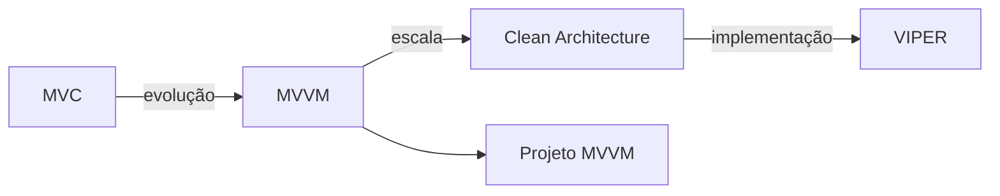

# Módulo 05 — Arquitetura de Apps iOS

🔴 **Avançado** · Estimativa: 8 horas

A arquitetura é o que separa apps que crescem de forma sustentável daqueles que viram um "spaghetti" impossível de manter. Este módulo cobre os padrões mais usados no mercado iOS.

---

## Por que arquitetura importa?

!!! info "Sintoma de falta de arquitetura"
    Um `ViewController` ou `View` com 500+ linhas, misturando lógica de negócio, chamadas de rede e manipulação de UI — o famoso **Massive View Controller**.

Uma boa arquitetura:

- ✅ Facilita testes unitários
- ✅ Permite trabalho em equipe sem conflitos
- ✅ Torna o código previsível e legível
- ✅ Facilita mudanças e novas funcionalidades

---

## Padrões cobertos

---

## Estrutura do módulo

| Aula | Tópico | Nível | Tempo |
|---|---|---|---|
| 5.1 | [MVC](mvc.md) | Intermediário | 1h |
| 5.2 | [MVVM](mvvm.md) | Avançado | 2h |
| 5.3 | [Clean & VIPER](clean-viper.md) | Avançado | 2h |
| 5.4 | [Projeto: Refatoração MVVM](projeto.md) | Avançado | 3h |

---

## Pré-requisitos

- [x] [Módulo 01 — Fundamentos](../01-fundamentos/index.md)
- [x] [Módulo 02 — OOP & Protocolos](../02-oop-protocolos/index.md)
- [x] [Módulo 03 — SwiftUI](../03-swiftui/index.md)

---

## Qual padrão usar?

| Contexto | Recomendação |
|---|---|
| Projeto pessoal pequeno | MVC ou MVVM simples |
| App em equipe, SwiftUI | MVVM + Repository |
| App grande, equipe grande | Clean Architecture |
| App UIKit legado com features isoladas | VIPER por feature |
