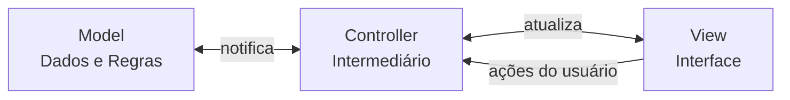

# MVC — Model-View-Controller

🟡 **Intermediário** · Módulo 05

MVC é o padrão nativo do UIKit e o ponto de partida para entender arquitetura iOS. Quando bem aplicado, é suficiente para muitos apps.

---

## Os três papéis



| Camada | Responsabilidade |
|---|---|
| **Model** | Dados, regras de negócio, persistência |
| **View** | Exibição, inputs do usuário — sem lógica |
| **Controller** | Conecta Model e View — nada mais |

---

## O problema do Massive View Controller

```swift
// ❌ Anti-padrão: VC fazendo tudo
class ProdutosVC: UIViewController {
    // Networking
    func fetchProdutos() {
        URLSession.shared.dataTask(with: url) { data, _, _ in
            let produtos = try? JSONDecoder().decode([Produto].self, from: data!)
            DispatchQueue.main.async {
                self.produtos = produtos ?? []
                self.tableView.reloadData()
            }
        }.resume()
    }

    // Formatação
    func formatarPreco(_ preco: Double) -> String { ... }

    // Persistência
    func salvarFavorito(_ produto: Produto) { UserDefaults.standard... }

    // UITableViewDataSource, UITableViewDelegate, UISearchResultsUpdating...
    // 600 linhas depois... 😱
}
```

---

## MVC bem aplicado

=== "Model"
    ```swift
    // Produto.swift — apenas dados e regras
    struct Produto: Codable, Identifiable {
        let id: Int
        let nome: String
        let preco: Double
        let categoria: String

        var precoFormatado: String {
            preco.formatted(.currency(code: "BRL"))
        }

        var emsaldo: Bool { preco < 50 }
    }

    // ProdutoService.swift — acesso a dados
    final class ProdutoService {
        func buscarProdutos() async throws -> [Produto] {
            let url = URL(string: "https://api.exemplo.com/produtos")!
            let (data, _) = try await URLSession.shared.data(from: url)
            return try JSONDecoder().decode([Produto].self, from: data)
        }
    }
    ```

=== "View"
    ```swift
    // ProdutoCell.swift — apenas exibição
    final class ProdutoCell: UITableViewCell {
        static let reuseID = "ProdutoCell"
        private let nomeLabel  = UILabel()
        private let precoLabel = UILabel()

        func configurar(com produto: Produto) {
            nomeLabel.text  = produto.nome
            precoLabel.text = produto.precoFormatado
        }
    }
    ```

=== "Controller"
    ```swift
    // ProdutosVC.swift — apenas coordenação
    final class ProdutosVC: UIViewController {
        private let service   = ProdutoService()
        private var produtos: [Produto] = []
        private let tableView = UITableView()

        override func viewDidLoad() {
            super.viewDidLoad()
            setupUI()
            Task { await carregarProdutos() }
        }

        private func carregarProdutos() async {
            do {
                produtos = try await service.buscarProdutos()
                tableView.reloadData()
            } catch {
                mostrarErro(error)
            }
        }
    }
    ```

---

## Quando MVC é suficiente

- ✅ Apps simples com poucas telas
- ✅ Projetos solo de curto prazo
- ✅ Prototipagem rápida
- ❌ Apps grandes com regras de negócio complexas
- ❌ Equipes grandes (conflitos de merge no VC)
- ❌ Quando você precisa de testes unitários robustos

---

## Checklist

- [x] Sei separar Model, View e Controller
- [x] Evito o Massive View Controller
- [x] Coloco regras de negócio no Model, não no VC
- [x] Entendo as limitações do MVC no iOS
