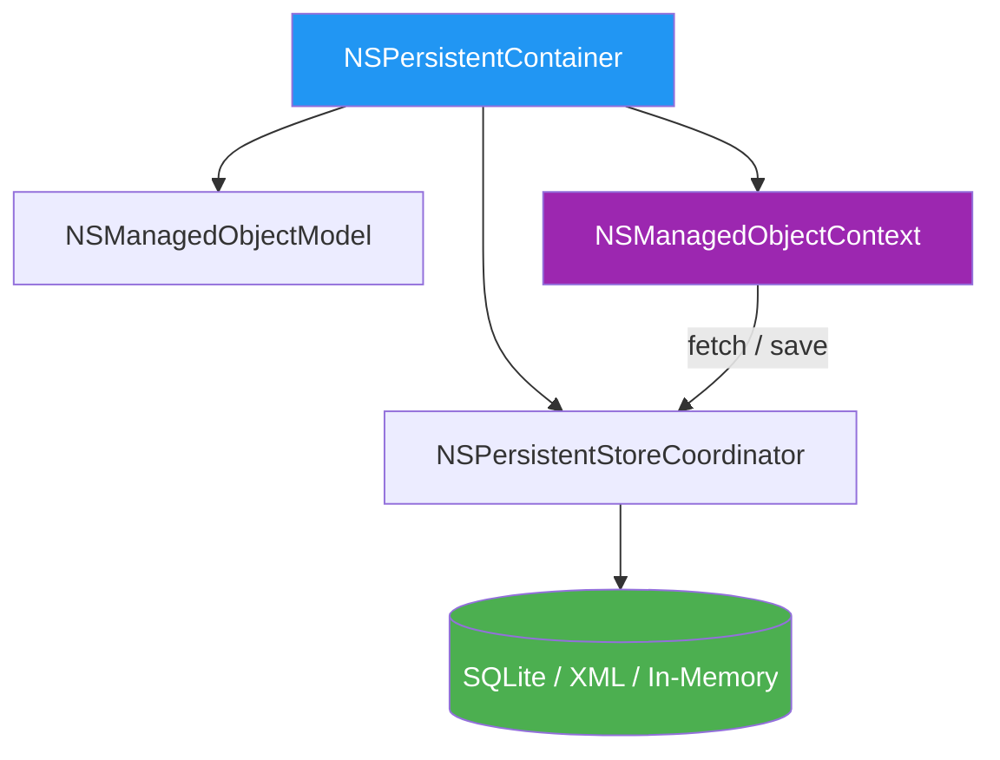

# Core Data

🟡 **Intermediário** · Módulo 06

**Core Data** é o framework de persistência objeto-relacional da Apple, disponível desde 2005. Não é um banco de dados SQL direto — é uma camada de gerenciamento de grafos de objetos que pode usar SQLite, XML ou armazenamento em memória como backend.

!!! info "Core Data vs SwiftData"
    Se você está começando um projeto novo com iOS 17+, considere usar **SwiftData** (próxima seção). Core Data é fundamental entender para projetos legados e para compreender o que SwiftData faz por baixo dos panos.

---

## O Stack do Core Data

O Core Data é composto por quatro componentes principais que trabalham juntos:



| Componente | Responsabilidade |
|---|---|
| `NSPersistentContainer` | "Caixa de entrada" — inicializa e encapsula todo o stack |
| `NSManagedObjectModel` | Define o schema (entidades, atributos, relacionamentos) |
| `NSPersistentStoreCoordinator` | Gerencia o arquivo no disco |
| `NSManagedObjectContext` | "Mesa de trabalho" — onde você cria, lê, atualiza e deleta objetos |

```swift
import CoreData

// Configuração mínima do stack (gerada automaticamente pelo Xcode)
class PersistenceController {
    static let shared = PersistenceController()  // (1)

    let container: NSPersistentContainer

    init(inMemory: Bool = false) {
        container = NSPersistentContainer(name: "MeuApp") // (2)

        if inMemory {
            container.persistentStoreDescriptions.first!.url
                = URL(fileURLWithPath: "/dev/null") // (3)
        }

        container.loadPersistentStores { description, error in
            if let error = error {
                fatalError("Erro ao carregar Core Data: \(error)") // (4)
            }
        }

        container.viewContext.automaticallyMergesChangesFromParent = true
    }
}
```

1. Singleton para acesso global — o `container` é pesado para criar repetidamente.
2. O nome deve corresponder exatamente ao arquivo `.xcdatamodeld` no projeto.
3. Armazenamento em memória — ideal para previews e testes unitários.
4. Em produção, trate o erro de forma mais elegante (logging, alertas) em vez de `fatalError`.

---

## O Modelo de Dados (.xcdatamodeld)

O arquivo `.xcdatamodeld` é o "blueprint" do seu banco de dados. Crie-o no Xcode:

**File → New → File → Data Model**

=== "Entidade: Tarefa"

    No editor visual do Xcode, crie uma **Entity** chamada `Tarefa` com os atributos:

    | Atributo | Tipo | Opcional |
    |---|---|---|
    | `id` | UUID | Não |
    | `titulo` | String | Não |
    | `descricao` | String | Sim |
    | `criadoEm` | Date | Não |
    | `concluida` | Boolean | Não |

=== "Configuração no Inspector"

    Para cada entidade, configure no **Data Model Inspector**:

    - **Class**: `Tarefa` (nome da classe gerada)
    - **Module**: `Current Product Module`
    - **Codegen**: `Class Definition` (Xcode gera a classe automaticamente)

!!! tip "Codegen: Class Definition vs Manual/None"
    - **Class Definition**: Xcode gera e atualiza a classe automaticamente. Use para começar.
    - **Manual/None**: Você cria e controla a classe. Use quando precisa adicionar métodos customizados.
    - **Category/Extension**: Xcode gera uma extensão, você cria a classe base. Equilíbrio entre os dois.

---

## NSManagedObject e Entidades

Com `Codegen: Class Definition`, o Xcode gera algo equivalente a:

```swift
// GERADO AUTOMATICAMENTE pelo Xcode (não edite este arquivo)
// Tarefa+CoreDataClass.swift
import Foundation
import CoreData

@objc(Tarefa)
public class Tarefa: NSManagedObject {}

// Tarefa+CoreDataProperties.swift
extension Tarefa {
    @nonobjc public class func fetchRequest() -> NSFetchRequest<Tarefa> {
        return NSFetchRequest<Tarefa>(entityName: "Tarefa")
    }

    @NSManaged public var id: UUID?
    @NSManaged public var titulo: String?
    @NSManaged public var descricao: String?
    @NSManaged public var criadoEm: Date?
    @NSManaged public var concluida: Bool
}
```

Para adicionar lógica customizada, use `Manual/None` e crie a classe:

```swift
// Arquivo que VOCÊ cria e mantém
import CoreData
import Foundation

@objc(Tarefa)
public class Tarefa: NSManagedObject {

    // Propriedade computada para tratamento de optional
    var tituloSeguro: String {
        titulo ?? "Sem título"
    }

    var descricaoSegura: String {
        descricao ?? ""
    }

    // Factory method — cria uma nova tarefa no contexto
    static func nova(no contexto: NSManagedObjectContext, titulo: String) -> Tarefa {
        let tarefa = Tarefa(context: contexto)
        tarefa.id = UUID()
        tarefa.titulo = titulo
        tarefa.criadoEm = Date()
        tarefa.concluida = false
        return tarefa
    }
}
```

---

## NSManagedObjectContext — A Mesa de Trabalho

O `NSManagedObjectContext` (MOC) é onde todo o trabalho acontece. Ele mantém os objetos em memória antes de persistir no disco.

```swift
// Acessando o contexto principal
let contexto = PersistenceController.shared.container.viewContext

// Para operações em background (nunca use viewContext em background!)
let contextoBackground = PersistenceController.shared.container.newBackgroundContext()
```

!!! warning "Thread Safety"
    `NSManagedObjectContext` **não é thread-safe**. O `viewContext` só deve ser usado na main thread. Para operações longas (importação de dados, operações em batch), use `newBackgroundContext()` ou `performBackgroundTask`.

---

## CRUD — Criar, Ler, Atualizar, Deletar

### Criar (Create)

```swift
func criarTarefa(titulo: String, descricao: String?) {
    let contexto = PersistenceController.shared.container.viewContext

    let tarefa = Tarefa(context: contexto) // (1)
    tarefa.id = UUID()
    tarefa.titulo = titulo
    tarefa.descricao = descricao
    tarefa.criadoEm = Date()
    tarefa.concluida = false

    salvar(contexto) // (2)
}

func salvar(_ contexto: NSManagedObjectContext) {
    guard contexto.hasChanges else { return } // (3)
    do {
        try contexto.save()
    } catch {
        print("Erro ao salvar: \(error.localizedDescription)")
        contexto.rollback() // (4)
    }
}
```

1. Criar um objeto com `init(context:)` insere-o automaticamente no contexto — ele já está "marcado" para ser salvo.
2. Centralize a lógica de save em um método auxiliar.
3. Verificar `hasChanges` antes de salvar evita writes desnecessários no banco.
4. `rollback()` desfaz todas as alterações não salvas no contexto.

### Ler (Read) com NSFetchRequest

```swift
// Busca simples — todas as tarefas
func buscarTarefas() -> [Tarefa] {
    let contexto = PersistenceController.shared.container.viewContext
    let request = Tarefa.fetchRequest() // (1)
    request.sortDescriptors = [NSSortDescriptor(keyPath: \Tarefa.criadoEm, ascending: false)]

    do {
        return try contexto.fetch(request)
    } catch {
        print("Erro ao buscar: \(error)")
        return []
    }
}

// Busca com predicate (filtro)
func buscarTarefasConcluidas() -> [Tarefa] {
    let contexto = PersistenceController.shared.container.viewContext
    let request = Tarefa.fetchRequest()
    request.predicate = NSPredicate(format: "concluida == %@", NSNumber(value: true)) // (2)
    request.sortDescriptors = [NSSortDescriptor(keyPath: \Tarefa.criadoEm, ascending: false)]

    do {
        return try contexto.fetch(request)
    } catch {
        return []
    }
}
```

1. O método estático `fetchRequest()` é gerado automaticamente pelo Xcode.
2. `NSPredicate` usa uma sintaxe de string — use `%@` para objetos, `%d` para inteiros.

### Atualizar (Update)

```swift
func concluirTarefa(_ tarefa: Tarefa) {
    tarefa.concluida = true // (1)
    salvar(PersistenceController.shared.container.viewContext)
}

func atualizarTarefa(_ tarefa: Tarefa, novoTitulo: String) {
    tarefa.titulo = novoTitulo
    salvar(PersistenceController.shared.container.viewContext)
}
```

1. Simplesmente modifique a propriedade do objeto — o Core Data rastreia automaticamente as mudanças (dirty tracking).

### Deletar (Delete)

```swift
func deletarTarefa(_ tarefa: Tarefa) {
    let contexto = PersistenceController.shared.container.viewContext
    contexto.delete(tarefa) // (1)
    salvar(contexto)
}

// Deletar múltiplos objetos
func deletarTarefasConcluidas() {
    let contexto = PersistenceController.shared.container.viewContext
    let tarefasConcluidas = buscarTarefasConcluidas()
    tarefasConcluidas.forEach { contexto.delete($0) }
    salvar(contexto)
}
```

1. `delete(_:)` marca o objeto para exclusão — ele será removido do banco quando o contexto for salvo.

---

## NSFetchRequest e Predicates

### Predicates úteis

```swift
// String contém (case-insensitive)
NSPredicate(format: "titulo CONTAINS[cd] %@", termoBusca) // (1)

// Intervalo de datas
NSPredicate(format: "criadoEm >= %@ AND criadoEm <= %@",
            dataInicio as NSDate, dataFim as NSDate)

// Comparação numérica
NSPredicate(format: "prioridade > %d", 2)

// IN — lista de valores
NSPredicate(format: "categoria IN %@", ["trabalho", "pessoal"])

// Combinando predicates
let predicateTitulo = NSPredicate(format: "titulo CONTAINS[cd] %@", busca)
let predicateConcluida = NSPredicate(format: "concluida == NO")
let composto = NSCompoundPredicate(andPredicateWithSubpredicates: [predicateTitulo, predicateConcluida]) // (2)
```

1. `[cd]` = case-insensitive + diacritic-insensitive. `c` = case insensitive, `d` = diacritic insensitive.
2. `NSCompoundPredicate` permite combinar predicates com AND, OR e NOT.

### FetchRequest com limite e offset (paginação)

```swift
let request = Tarefa.fetchRequest()
request.fetchLimit = 20   // (1)
request.fetchOffset = 40  // (2)
request.sortDescriptors = [NSSortDescriptor(keyPath: \Tarefa.criadoEm, ascending: false)]
```

1. Máximo de 20 resultados — essencial para listas longas.
2. Pula os primeiros 40 resultados — para implementar paginação.

---

## Relacionamentos

No editor de dados, crie relacionamentos entre entidades. Exemplo: `Categoria` tem muitas `Tarefa`s.

```swift
// Entidade: Categoria
// Atributos: id (UUID), nome (String)
// Relacionamento: tarefas → (Tarefa, to-many, cascade delete)

// Entidade: Tarefa
// Relacionamento: categoria → (Categoria, to-one)

// Uso
func criarCategoria(nome: String) -> Categoria {
    let contexto = PersistenceController.shared.container.viewContext
    let categoria = Categoria(context: contexto)
    categoria.id = UUID()
    categoria.nome = nome
    salvar(contexto)
    return categoria
}

func criarTarefaNaCategoria(_ categoria: Categoria, titulo: String) {
    let contexto = PersistenceController.shared.container.viewContext
    let tarefa = Tarefa(context: contexto)
    tarefa.id = UUID()
    tarefa.titulo = titulo
    tarefa.criadoEm = Date()
    tarefa.concluida = false
    tarefa.categoria = categoria  // (1)
    salvar(contexto)
}

// Buscar tarefas de uma categoria
func tarefasDaCategoria(_ categoria: Categoria) -> [Tarefa] {
    let tarefas = categoria.tarefas as? Set<Tarefa> ?? [] // (2)
    return tarefas.sorted { $0.criadoEm! < $1.criadoEm! }
}
```

1. Atribuir o objeto diretamente — o Core Data gerencia o relacionamento inverso automaticamente.
2. Relacionamentos to-many são expostos como `NSSet` — converta para `Set<T>` ou `[T]` para uso no Swift.

!!! tip "Regras de delete"
    Configure **Delete Rule** no editor de dados:

    - **Nullify** (padrão): apaga a referência no objeto relacionado, mas não o deleta
    - **Cascade**: apaga todos os objetos relacionados junto (ex: deletar categoria deleta suas tarefas)
    - **Deny**: impede deletar o objeto se houver relacionamentos ativos
    - **No Action**: não faz nada — cuidado, pode deixar referências inválidas

---

## Migração

Quando você altera o modelo de dados, precisa migrar os dados existentes:

=== "Lightweight Migration (automática)"

    Para mudanças simples (adicionar/remover atributo, renomear), o Core Data migra automaticamente:

    ```swift
    // Ative no loadPersistentStores
    let description = container.persistentStoreDescriptions.first!
    description.shouldMigrateStoreAutomatically = true      // (1)
    description.shouldInferMappingModelAutomatically = true  // (2)
    ```

    1. Tenta migrar automaticamente para a versão mais recente.
    2. Infere o modelo de mapeamento sem que você precise criar um `.xcmappingmodel`.

=== "Heavyweight Migration (manual)"

    Para mudanças complexas (mesclar entidades, transformar dados), crie versões do modelo:

    1. No editor de dados: **Editor → Add Model Version**
    2. Crie um arquivo `.xcmappingmodel`
    3. Implemente `NSEntityMigrationPolicy` para lógica de transformação

    ```swift
    // NSEntityMigrationPolicy customizada
    class TarefaMigrationPolicy: NSEntityMigrationPolicy {
        override func createDestinationInstances(
            forSource sInstance: NSManagedObject,
            in mapping: NSEntityMapping,
            manager: NSMigrationManager
        ) throws {
            // Lógica de transformação dos dados
            try super.createDestinationInstances(forSource: sInstance,
                                                 in: mapping,
                                                 manager: manager)
        }
    }
    ```

---

## Core Data com SwiftUI — @FetchRequest

O SwiftUI tem suporte nativo ao Core Data via `@FetchRequest`:

```swift
struct ListaTarefasView: View {
    // (1) Busca e observe automaticamente as tarefas
    @FetchRequest(
        sortDescriptors: [NSSortDescriptor(keyPath: \Tarefa.criadoEm, ascending: false)],
        predicate: NSPredicate(format: "concluida == NO"),
        animation: .default
    )
    private var tarefas: FetchedResults<Tarefa>

    @Environment(\.managedObjectContext) private var contexto // (2)

    var body: some View {
        List {
            ForEach(tarefas) { tarefa in
                TarefaRow(tarefa: tarefa)
            }
            .onDelete(perform: deletarTarefas)
        }
        .overlay {
            if tarefas.isEmpty {
                ContentUnavailableView("Sem tarefas",
                    systemImage: "checkmark.circle",
                    description: Text("Crie sua primeira tarefa"))
            }
        }
    }

    private func deletarTarefas(at offsets: IndexSet) {
        offsets.map { tarefas[$0] }.forEach(contexto.delete)
        try? contexto.save()
    }
}

// Injetando o contexto na hierarquia de views
@main
struct MeuApp: App {
    let controller = PersistenceController.shared

    var body: some Scene {
        WindowGroup {
            ContentView()
                .environment(\.managedObjectContext, controller.container.viewContext) // (3)
        }
    }
}
```

1. `@FetchRequest` observa o Core Data e atualiza a lista automaticamente quando dados mudam.
2. `managedObjectContext` é injetado pelo ambiente — disponível em qualquer view filha.
3. Injete o `viewContext` uma vez na raiz do app.

### @FetchRequest dinâmico

```swift
struct BuscaTarefasView: View {
    @State private var termoBusca = ""

    // FetchRequest que se reconfigura com base no estado
    @FetchRequest private var tarefas: FetchedResults<Tarefa>

    init(termoBusca: String) {
        let predicate = termoBusca.isEmpty
            ? nil
            : NSPredicate(format: "titulo CONTAINS[cd] %@", termoBusca)

        _tarefas = FetchRequest( // (1)
            sortDescriptors: [NSSortDescriptor(keyPath: \Tarefa.criadoEm, ascending: false)],
            predicate: predicate
        )
    }

    var body: some View {
        List(tarefas) { tarefa in
            Text(tarefa.titulo ?? "")
        }
        .searchable(text: $termoBusca)
        .onChange(of: termoBusca) { _, novo in
            // Reconfigurar o fetchRequest quando a busca muda
            tarefas.nsPredicate = novo.isEmpty
                ? nil
                : NSPredicate(format: "titulo CONTAINS[cd] %@", novo) // (2)
        }
    }
}
```

1. `_tarefas` acessa o `FetchRequest` subjacente diretamente para inicializá-lo no `init`.
2. `nsPredicate` pode ser atualizado em tempo de execução — a lista se atualiza automaticamente.

---

## Considerações de Performance

!!! tip "Boas práticas de performance"

    **Faulting**: Core Data usa "faults" — objetos "fantasmas" que não carregam dados relacionados até que você acesse a propriedade. Isso é automático e muito eficiente.

    **Batch operations**: Para deletar ou atualizar milhares de registros, use `NSBatchDeleteRequest` ou `NSBatchUpdateRequest` — eles operam diretamente no banco sem carregar objetos em memória.

    ```swift
    // Deletar em batch (muito mais rápido que deletar um a um)
    func deletarTodasTarefasConcluidas() {
        let request = NSFetchRequest<NSFetchRequestResult>(entityName: "Tarefa")
        request.predicate = NSPredicate(format: "concluida == YES")

        let batchDelete = NSBatchDeleteRequest(fetchRequest: request)
        batchDelete.resultType = .resultTypeObjectIDs

        do {
            let result = try PersistenceController.shared.container.viewContext
                .execute(batchDelete) as? NSBatchDeleteResult
            let ids = result?.result as? [NSManagedObjectID] ?? []
            // Sincronizar mudanças com o viewContext
            NSManagedObjectContext.mergeChanges(
                fromRemoteContextSave: [NSDeletedObjectsKey: ids],
                into: [PersistenceController.shared.container.viewContext]
            )
        } catch {
            print("Erro no batch delete: \(error)")
        }
    }
    ```

    **fetchBatchSize**: Carrega objetos em lotes para listas longas.
    ```swift
    request.fetchBatchSize = 20 // Carrega 20 por vez
    ```

---

## Resumo

!!! abstract "O que aprendemos"
    - Core Data é um framework de gerenciamento de grafos de objetos, não um banco SQL direto
    - `NSPersistentContainer` inicializa e encapsula todo o stack
    - O arquivo `.xcdatamodeld` define o schema de dados
    - `NSManagedObjectContext` é onde você realiza operações CRUD
    - `NSFetchRequest` com `NSPredicate` filtra e ordena dados eficientemente
    - `@FetchRequest` integra Core Data nativamente com SwiftUI
    - Lightweight migration automatiza mudanças simples de schema
    - Operações em batch são muito mais performáticas para grandes volumes

---

[:octicons-arrow-right-24: Próximo: SwiftData](swiftdata.md){ .md-button .md-button--primary }
