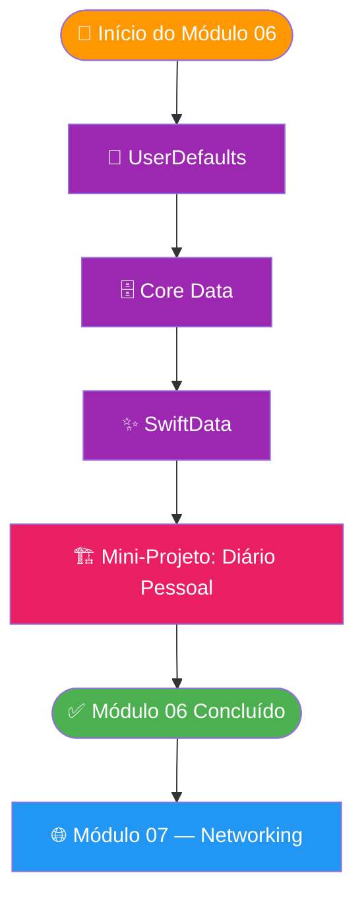

# Módulo 06 — Persistência de Dados

🟡 **Intermediário** · Módulo 06

Dados que desaparecem quando o app fecha são inúteis. Neste módulo você aprenderá a **salvar, recuperar e gerenciar dados localmente no iOS**, dominando as três principais soluções de persistência da plataforma Apple: UserDefaults, Core Data e SwiftData.

---

## O que é persistência?

**Persistência** é a capacidade de um aplicativo manter dados entre sessões. Quando o usuário fecha o app e o reabre — horas, dias ou semanas depois — os dados devem estar exatamente como ele os deixou.

!!! info "Por que persistência é fundamental?"
    Imagine um app de tarefas que perde todas as tarefas ao fechar, ou um app de diário que apaga tudo quando o usuário sai. Sem persistência, seus apps são apenas protótipos descartáveis. Com ela, você cria experiências reais e úteis.

---

## Comparação das opções

| Solução | Ideal para | Capacidade | Complexidade |
|---|---|---|---|
| **UserDefaults** | Preferências, configurações simples | Pequeno (< 1 MB) | ⭐ Baixa |
| **Core Data** | Dados relacionais complexos, grandes volumes | Grande | ⭐⭐⭐ Alta |
| **SwiftData** | Dados relacionais, apps modernos (iOS 17+) | Grande | ⭐⭐ Média |
| **FileManager** | Arquivos, imagens, documentos | Ilimitado | ⭐⭐ Média |
| **Keychain** | Senhas, tokens, dados sensíveis | Pequeno | ⭐⭐ Média |

!!! warning "O que NÃO cobrimos aqui"
    Este módulo foca em **persistência local**. Bancos de dados remotos (Firebase, CloudKit, REST APIs com cache) são abordados em módulos posteriores.

---

## O que você vai aprender

- [x] Usar **UserDefaults** para salvar preferências e configurações
- [x] Criar e manipular objetos com **@AppStorage** no SwiftUI
- [x] Modelar dados relacionais com **Core Data** (NSPersistentContainer)
- [x] Realizar operações CRUD com `NSManagedObjectContext`
- [x] Usar **SwiftData** com a macro `@Model` (Swift 5.9+/iOS 17+)
- [x] Integrar persistência com SwiftUI usando `@FetchRequest` e `@Query`
- [x] Entender migrações de banco de dados
- [x] Construir um mini-projeto: Diário Pessoal com SwiftData

---

## Pré-requisitos

!!! warning "Antes de começar"
    Este módulo assume conhecimento dos módulos anteriores:

    - **Módulo 03 (SwiftUI)** — você deve saber criar views e usar property wrappers
    - **Módulo 05 (Arquitetura)** — padrão MVVM será usado nos projetos
    - Swift básico: structs, classes, protocolos, generics e closures

---

## Tempo estimado

| Seção | Tempo estimado |
|---|---|
| UserDefaults e @AppStorage | ~1h 30min |
| Core Data | ~2h 30min |
| SwiftData | ~2h |
| Mini-Projeto: Diário Pessoal | ~2h |
| **Total do módulo** | **~8 horas** |

---

## Estrutura do módulo

=== "Visão Geral"

    ```
    Módulo 06 — Persistência
    ├── 📱  UserDefaults e @AppStorage
    ├── 🗄️  Core Data
    ├── ✨  SwiftData (iOS 17+)
    └── 🏗️  Mini-Projeto: Diário Pessoal
    ```

=== "Quando usar cada um"

    **Use UserDefaults quando:**
    - Guardar preferências do usuário (tema, idioma, notificações ativas)
    - Salvar o estado simples da UI (aba selecionada, filtros)
    - Armazenar dados primitivos pequenos

    **Use Core Data quando:**
    - Suporte a iOS 16 ou anterior é necessário
    - O projeto já usa Core Data
    - Você precisa de performance máxima com grandes datasets

    **Use SwiftData quando:**
    - Você está em um projeto novo com iOS 17+
    - Quer menos boilerplate e integração nativa com Swift
    - Quer a solução moderna e recomendada pela Apple

=== "Linha do tempo das tecnologias"

    - **2003** — Core Data nasce no macOS
    - **2005** — Core Data chega ao iOS (iPhone OS)
    - **2014** — Swift é lançado
    - **2019** — SwiftUI é lançado
    - **2023** — SwiftData é anunciado na WWDC23 (iOS 17, Swift 5.9)

---

## Fluxo dos tópicos



---

## Navegação do módulo

<div class="grid cards" markdown>

-   :material-cog:{ .lg .middle } **UserDefaults**

    ---

    Salve preferências e pequenos dados com a API mais simples do iOS.

    [:octicons-arrow-right-24: Começar](userdefaults.md)

-   :material-database:{ .lg .middle } **Core Data**

    ---

    O banco de dados objeto-relacional da Apple para grandes volumes de dados.

    [:octicons-arrow-right-24: Aprender](coredata.md)

-   :material-lightning-bolt:{ .lg .middle } **SwiftData**

    ---

    A solução moderna de persistência com macros Swift e integração total com SwiftUI.

    [:octicons-arrow-right-24: Explorar](swiftdata.md)

-   :material-book-open:{ .lg .middle } **Mini-Projeto: Diário Pessoal**

    ---

    Construa um app de diário completo usando SwiftData + SwiftUI + MVVM.

    [:octicons-arrow-right-24: Construir](projeto.md)

</div>

---

## Checklist de início

- [ ] Você concluiu os Módulos 01 a 05
- [ ] Xcode 15 ou superior instalado (necessário para SwiftData)
- [ ] Você entende `@State`, `@ObservedObject` e `@StateObject` no SwiftUI
- [ ] Você sabe o que é o padrão MVVM

---

*Pronto para nunca mais perder dados? Vamos começar com o UserDefaults!*

[:octicons-arrow-right-24: Ir para: UserDefaults](userdefaults.md){ .md-button .md-button--primary }
