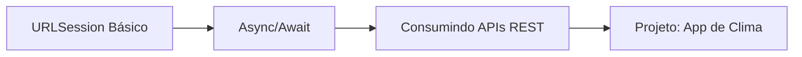

# Módulo 07 — Networking

🟡 **Intermediário** · Estimativa: 10 horas

Praticamente todo app moderno consome dados de uma API. Este módulo ensina a fazer networking de forma correta, moderna e segura em Swift.

---

## O que você vai aprender

---

## Pré-requisitos

- [x] [Módulo 01 — Fundamentos](../01-fundamentos/index.md) (especialmente Optionals)
- [x] [Módulo 02 — OOP & Protocolos](../02-oop-protocolos/index.md) (Codable)
- [x] [Módulo 05 — Arquitetura](../05-arquitetura/index.md) (MVVM)

---

## Estrutura do módulo

| Aula | Tópico | Tempo |
|---|---|---|
| 7.1 | [URLSession](urlsession.md) | 2h |
| 7.2 | [Async/Await](async-await.md) | 3h |
| 7.3 | [Consumindo APIs REST](consumindo-apis.md) | 2h |
| 7.4 | [Projeto: App de Clima](projeto.md) | 3h |

---

## Stack de networking no iOS

| Camada | Tecnologia | Responsabilidade |
|---|---|---|
| Transporte | `URLSession` | HTTP requests, cookies, caching |
| Concorrência | `async/await` | Código assíncrono sem callbacks |
| Serialização | `Codable` / `JSONDecoder` | JSON ↔ Swift structs |
| Arquitetura | Service / Repository | Abstração e testabilidade |

!!! info "Sobre Alamofire"
    Alamofire é uma biblioteca popular que abstrai URLSession. No entanto, URLSession moderno com async/await é tão limpo quanto Alamofire, sem adicionar dependências. Este módulo foca em URLSession nativo.
