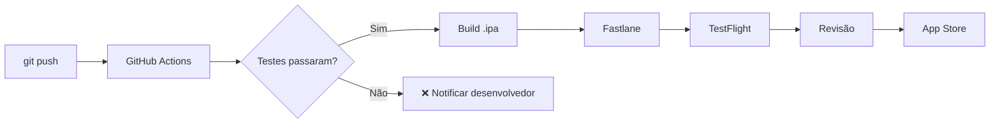

# Módulo 09 — CI/CD e Publicação

🔴 **Avançado** · Estimativa: 6 horas

Automatizar o processo de build, teste e publicação economiza horas toda semana e reduz erros humanos. Este módulo cobre as ferramentas usadas por equipes profissionais.

---

## O pipeline completo

---

## Pré-requisitos

- [x] Apple Developer Account (USD 99/ano)
- [x] [Módulo 08 — Testes](../08-testes/index.md)
- [x] App com testes automatizados

---

## Estrutura do módulo

| Aula | Tópico | Tempo |
|---|---|---|
| 9.1 | [Fastlane](fastlane.md) | 2h |
| 9.2 | [GitHub Actions para iOS](github-actions.md) | 2h |
| 9.3 | [TestFlight & App Store](testflight.md) | 1h |
| 9.4 | [Projeto: Pipeline Completo](projeto.md) | 1h |

---

!!! info "Custo"
    Todas as ferramentas deste módulo são gratuitas ou open-source. O único custo é a Apple Developer Account (necessária para publicar).
