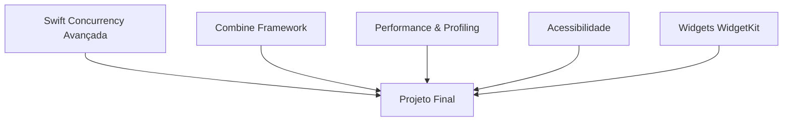

# Módulo 10 — Tópicos Avançados

🔴 **Avançado** · Estimativa: 15 horas

Este módulo cobre os temas que diferenciam desenvolvedores sêniores: concorrência avançada, Combine, performance, acessibilidade, widgets e um projeto final integrador.

---

## O que você vai aprender

---

## Pré-requisitos

- [x] Todos os módulos anteriores (01–09)
- [x] Confortável com async/await
- [x] Experiência com SwiftUI e MVVM

---

## Estrutura do módulo

| Aula | Tópico | Tempo |
|---|---|---|
| 10.1 | [Concurrency Avançada](concurrency.md) | 3h |
| 10.2 | [Combine Framework](combine.md) | 3h |
| 10.3 | [Performance](performance.md) | 2h |
| 10.4 | [Acessibilidade](acessibilidade.md) | 2h |
| 10.5 | [Widgets WidgetKit](widgets.md) | 2h |
| 10.6 | [Projeto Final](projeto-final.md) | 3h |

!!! info "Este é o módulo final"
    Ao concluir, você terá as habilidades para construir, testar, publicar e manter apps iOS profissionais do zero ao avançado.
