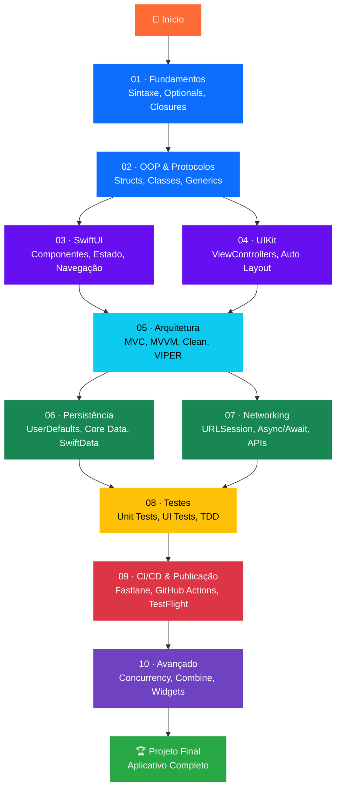

# Swift iOS — Do Zero ao Avançado

---

Bem-vindo ao **curso completo e gratuito** de desenvolvimento iOS com Swift. Este material foi criado para levar você do absoluto zero até um nível avançado de desenvolvimento de aplicativos nativos para iPhone e iPad — com exemplos práticos, mini-projetos reais e uma estrutura didática pensada para desenvolvedores de todos os níveis.

!!! tip "Totalmente gratuito e open-source"
    Todo o conteúdo deste curso é gratuito, aberto e colaborativo. Contribuições são bem-vindas — veja a seção [Como Contribuir](#como-contribuir) abaixo.

---

## Trilha do Curso

O curso está organizado em **10 módulos progressivos**. Cada módulo constrói sobre o anterior, culminando em um mini-projeto que consolida o que você aprendeu.

---

## Módulos do Curso

| # | Módulo | Dificuldade | Horas Est. | Descrição |
|---|--------|-------------|------------|-----------|
| 01 | [Fundamentos](01-fundamentos/index.md) |  | ~8h | Sintaxe Swift, tipos, funções, closures e optionals |
| 02 | [OOP & Protocolos](02-oop-protocolos/index.md) |  | ~8h | Structs, classes, herança, protocolos e generics |
| 03 | [SwiftUI](03-swiftui/index.md) |  | ~12h | Declarative UI, estado, bindings, navegação e listas |
| 04 | [UIKit](04-uikit/index.md) |  | ~10h | ViewControllers, Auto Layout programático e TableViews |
| 05 | [Arquitetura](05-arquitetura/index.md) |  | ~10h | MVC, MVVM, Clean Architecture e VIPER |
| 06 | [Persistência](06-persistencia/index.md) |  | ~8h | UserDefaults, Core Data e SwiftData |
| 07 | [Networking](07-networking/index.md) |  | ~8h | URLSession, Async/Await e consumo de APIs REST |
| 08 | [Testes](08-testes/index.md) |  | ~8h | XCTest, Unit Tests, UI Tests e TDD na prática |
| 09 | [CI/CD & Publicação](09-cicd-publicacao/index.md) |  | ~6h | Fastlane, GitHub Actions e publicação na App Store |
| 10 | [Avançado](10-avancado/index.md) |  | ~12h | Concurrency, Combine, Performance, Widgets e Acessibilidade |

**Total estimado: ~90 horas de conteúdo**

---

## Como Começar

!!! abstract "Pré-requisitos"
    - Um Mac com **macOS Ventura (13) ou superior**
    - **Xcode 15+** instalado (gratuito na Mac App Store)
    - Vontade de aprender — nenhum conhecimento prévio de iOS é necessário!

Siga estes passos para dar o pontapé inicial:

- [x] **Passo 1** — Leia a página [Sobre o Curso](sobre.md) para entender a filosofia e abordagem
- [x] **Passo 2** — Instale o Xcode seguindo o guia em [Ambiente de Dev](01-fundamentos/ambiente.md)
- [x] **Passo 3** — Comece pelo módulo [01 · Fundamentos](01-fundamentos/index.md)
- [x] **Passo 4** — Complete cada mini-projeto antes de avançar ao próximo módulo
- [x] **Passo 5** — Ao final, construa seu **Projeto Final** no módulo 10

!!! warning "Importante"
    Não pule os mini-projetos! Eles são essenciais para fixar o conteúdo de cada módulo e formam a base do projeto final.

---

## Para quem é este curso?

=== "Iniciantes absolutos"

    Você nunca programou para iOS antes? Perfeito. O curso começa do básico absoluto da linguagem Swift e evolui gradualmente. Você não precisa ter experiência prévia com desenvolvimento mobile.

    **Você vai aprender:**

    - Lógica de programação com Swift
    - Como criar sua primeira interface visual
    - Como o ecossistema iOS funciona

=== "Desenvolvedores de outras plataformas"

    Já programa em Android, web ou back-end? Este curso vai te ajudar a fazer a transição para iOS de forma suave, com analogias e comparações ao longo do conteúdo.

    **Destaques para você:**

    - Comparações entre Swift e outras linguagens
    - Arquitetura de apps iOS vs outros paradigmas
    - Ferramentas e fluxo de trabalho do ecossistema Apple

=== "Devs iOS que querem se atualizar"

    Conhece Objective-C ou versões antigas do Swift? Este curso usa Swift 5.9+, SwiftUI e SwiftData — tecnologias modernas que toda a indústria está adotando.

    **O que há de novo:**

    - SwiftUI com macros e novos recursos
    - SwiftData como substituto moderno ao Core Data
    - Swift Concurrency (async/await, actors)
    - Widgets com WidgetKit

---

## O que você vai construir?

Ao longo do curso, você vai construir mini-projetos práticos em cada módulo. No módulo final, todos esses conhecimentos se unem em um **aplicativo completo e publicável** na App Store.

!!! example "Projeto Final — SafeApp"
    Um aplicativo iOS completo com autenticação de usuário, consumo de API REST, persistência local com SwiftData, testes automatizados, e pipeline de CI/CD configurado para publicação automática no TestFlight.

---

## Como Contribuir

Este é um projeto open-source e toda contribuição é bem-vinda!

=== "Reportar erros"

    Encontrou um erro de conteúdo, código que não compila ou informação desatualizada?

    [Abrir uma Issue no GitHub :material-github:](https://github.com/jvcamposs/safeville/issues/new){ .md-button }

=== "Contribuir com conteúdo"

    Quer adicionar um novo tópico, melhorar uma explicação ou adicionar exemplos?

    1. Faça um fork do repositório
    2. Crie uma branch: `git checkout -b feat/meu-topico`
    3. Faça suas alterações seguindo o [guia de contribuição](https://github.com/jvcamposs/safeville/blob/main/CONTRIBUTING.md)
    4. Abra um Pull Request

=== "Dar uma estrela"

    A forma mais simples de apoiar o projeto:

    [Dar uma estrela no GitHub :material-star:](https://github.com/jvcamposs/safeville){ .md-button .md-button--primary }

---

!!! quote "Filosofia do curso"
    *"A melhor forma de aprender desenvolvimento iOS é construindo. Cada conceito aqui é acompanhado de código real, projetos práticos e desafios que você pode usar no seu portfólio."*
